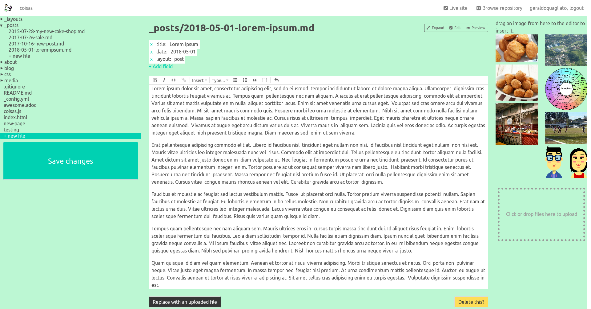

 coisas

**coisas** is a headless CMS specifically designed to let you edit files hosted in a GitHub repository. It is similar to [Netlify CMS](https://github.com/netlify/netlify-cms) and [Prose](http://prose.io/). Unlike existing alternatives, **coisas** doesn't try to be a multipurpose CMS. It still lets you edit, create, upload, and browse files, but doesn't try to look like a fancy CMS (custom schema, objects and all that mess). It also isn't tailored to Jekyll websites, which means that it won't insert Jekyll specific code or expect your repository to have a Jekyll-specific file structure.

Other features that **coisas** includes are:

- File tree view;
- Simple metadata editor and automatic saving of Markdown and HTML files with YAML front-matter;
- Behavior customizations that can be configured from your repository, while still accessing **coisas** from its own URL;
- Easy embedding in your own site, so you'll never have to touch **coisas** own URL;
- Image gallery with all the images from your repository, so you can drag and drop them inside the editor;
- Simple visualization of many file formats (only text files are editable, however).

## Usage

To use **coisas**, go to https://coisas.alhur.es/ or embed it in your site, for example, in an `/admin/` section (more detailed instructions on how to do this may come - for the meantime please copy the hosted version file structure).

## Demo

There is a demo site at https://geraldoquagliato.github.io/, which you can browse and edit (no login necessary) by visiting https://coisas.alhur.es/#!/geraldoquagliato/geraldoquagliato.github.io/. Please be decent.

### Screenshot

Here's a screenshot if you don't have time for the demo (this is the raw interface, before any client-side customization or live-preview is set-up):

## Customization

To customize the app behavior specifically for your repository, create a file named `coisas.js` and put it at the root of the repository. That file may contain anything and will be loaded and executed dynamically by **coisas** as part of its initialization process.

From that file you must modify the global object `window.qontent`, whose defaults are specified in [preferences.js](preferences.js) (along with comments to explain each property). If you need more customization options I'm happy to include them, please open an issue.

#### Styles

You can customize many of the original styles of **coisas** UI (which, I admit, are not pretty). You can do it by simply modifying the [CSS variables](https://developer.mozilla.org/en-US/docs/Web/CSS/Using_CSS_variables) made available at the top of [main.scss](main.scss) in your `coisas.js` file along with their defaults.

Basically you just run `document.body.style.setProperty("--variable-name", "value")`. The names should be somewhat self-descriptive, but if they aren't please solve that by doing manual experimentation in the browser console.

#### Previews

Through the customization file, you may define a couple of functions that will enable previews in the edit session of **coisas** (a couple of buttons will be shown allowing the editor to switch between the _edit_ view and the _preview_ view). See [preferences.js](preferences.js) for more information about how to do that.

## Development

To run **coisas** locally, you can `git clone` the repo, then `cd` to it and `npm install`, then `npm run build`. If you want to rebuild automatically every time you change a file, you'll need [entr](http://entrproject.org/), so you can `npm run watch`.

Besides all that, a static server is needed. There are thousands out there for you to choose. My current preference is [Caddy](https://caddyserver.com/), because it will run your site on HTTPS automatically if you have a canonical hostname (just modify [Caddyfile](Caddyfile) with yours). Running **coisas** on HTTPS is required for the [service-worker.js](service-worker.js) to be installed, but that is not necessary (although without it the editor image previews may fail).

## Meta

##### Source tree for this repository

(The majority of action happens at [components/Repo.js](components/Repo.js) and [state.js](state.js), although Prosemirror takes a lot of space in the tree due to its hypermodularization)

##### Visit analytics for this repository

